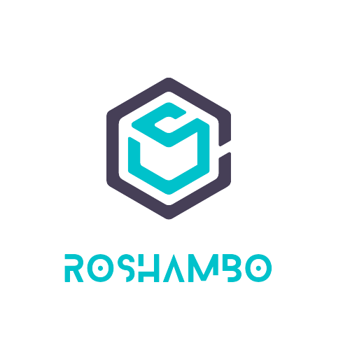

# **Roshambo**
<p align="center">
  <a href="https://myroshambo.us/" target="_blank"></a>
</p>

Our website [**myroshambo.us**](https://myroshambo.us/) is a popular game Rock-Paper-Scissors adding some more features in it. <br>
The amazing thing about our site is it is responsive, that means you can play on any device anytime and enjoy Roshambo.

----
### This Project is for Hackathon purpose.
### Languages and tools Used

* HTML5 
* CSS3
* JAVASCRIPT
* BOOTSTRAP
* CANVA FOR IMAGES
***

### For site hosting-
* [godaddy](https://in.godaddy.com/)
* [Porkbun](https://porkbun.com/)

## Environment Setup

### 1.Fork The Repo

### 2.Clone App

Make a new folder and open the terminal there.
-write the following commands and press enter.
 ```
 $ git clone  https://github.com/<your-github-username>/Roshambo.git
 ```
and then move to the folder using this command:

 ```
 $ cd Roshambo
 ```
 #### 3.Run project
 
   * Either you can open with live server,

 #### Or

   * Go to the website: [myroshoambo.us](https://myroshambo.us/)


***
## Folder Structure

````
├── assets
│   ├── bootstrap
│   ├── css
│   ├── fonts
│   ├── img
│   └── js
├── README.md
├── index.html
├── style.css
└── main.js
````
